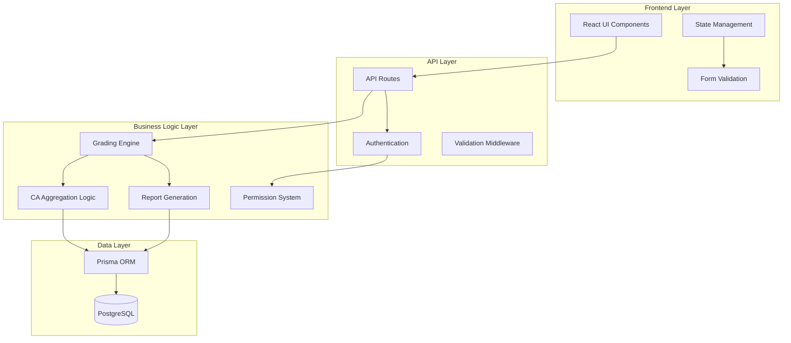

# Design Document: Teacher Marks Management System

## Overview

The Teacher Marks Management System is a comprehensive solution that enables both class teachers and regular teachers to manage student marks according to the new curriculum requirements. The system implements sophisticated grading logic that properly separates raw CA entries, CA aggregation, and final weighting to ensure mathematical accuracy and curriculum compliance.

The system features a progressive filtering interface (Class → Stream → Subject → Students), supports multiple CA entry types, implements proper grade aggregation mathematics, and provides three-tier reporting capabilities. It includes comprehensive UI/UX design with responsive layouts, accessibility compliance, and seamless integration with existing teacher dashboards.

## Architecture

### High-Level Architecture



### System Components

1. **Progressive Filter System**: Handles Class → Stream → Subject → Student selection
2. **CA Entry Management**: Manages multiple CA entries per subject with proper typing
3. **Grading Engine**: Core mathematical logic for grade calculations and aggregation
4. **Reporting Engine**: Generates three-tier reports (CA-only, Exam-only, Final)
5. **Approval Workflow**: Handles DoS approval and locking mechanisms
6. **UI Component Library**: Responsive, accessible interface components

## Components and Interfaces

### Core Data Models

#### CA Entry Model

```typescript
interface CAEntry {
  id: string;
  subjectId: string;
  studentId: string;
  teacherId: string;
  termId: string;

  // CA Entry Details
  name: string; // e.g., "Assignment 1 - Algebra"
  type: CAType; // Assignment, Test, Project, Practical, Observation
  maxScore: number; // Custom max score (not always 100)
  rawScore: number; // Student's actual score
  date: Date;

  // Curriculum Integration
  competencyId?: string;
  competencyComment?: string;

  // Workflow
  status: SubmissionStatus;
  submittedAt?: Date;
  approvedAt?: Date;
  approvedBy?: string;

  // Audit
  createdAt: Date;
  updatedAt: Date;
}

enum CAType {
  ASSIGNMENT = "ASSIGNMENT",
  TEST = "TEST",
  PROJECT = "PROJECT",
  PRACTICAL = "PRACTICAL",
  OBSERVATION = "OBSERVATION",
}

enum SubmissionStatus {
  DRAFT = "DRAFT",
  SUBMITTED = "SUBMITTED",
  APPROVED = "APPROVED",
  REJECTED = "REJECTED",
}
```

#### Exam Entry Model

```typescript
interface ExamEntry {
  id: string;
  subjectId: string;
  studentId: string;
  teacherId: string;
  termId: string;

  // Exam Details
  examScore: number; // Out of 100
  maxScore: 100; // Always 100 for exams
  examDate: Date;

  // Workflow
  status: SubmissionStatus;
  submittedAt?: Date;
  approvedAt?: Date;
  approvedBy?: string;

  // Audit
  createdAt: Date;
  updatedAt: Date;
}
```

#### Grade Calculation Model

```typescript
interface GradeCalculation {
  studentId: string;
  subjectId: string;
  termId: string;

  // CA Calculation
  caEntries: CAEntry[];
  caPercentages: number[]; // Each CA converted to percentage
  averageCAPercentage: number; // Mean of all CA percentages
  caContribution: number; // Out of 20 (averageCAPercentage * 0.2)

  // Exam Calculation
  examEntry?: ExamEntry;
  examContribution: number; // Out of 80 ((examScore / 100) * 80)

  // Final Calculation
  finalScore: number; // caContribution + examContribution

  // Status
  hasCA: boolean;
  hasExam: boolean;
  isComplete: boolean; // Both CA and Exam approved

  // Metadata
  calculatedAt: Date;
  lastUpdated: Date;
}
```

### API Interfaces

#### Progressive Filter API

```typescript
// GET /api/teacher/classes
interface TeacherClassesResponse {
  classes: {
    id: string;
    name: string;
    level: string;
    enrollmentCount: number;
    teacherRole: "CLASS_TEACHER" | "SUBJECT_TEACHER";
    subjects: string[]; // Subject IDs teacher can access
  }[];
}

// GET /api/teacher/classes/{classId}/streams
interface ClassStreamsResponse {
  streams: {
    id: string;
    name: string;
    studentCount: number;
  }[];
}

// GET /api/teacher/classes/{classId}/subjects
interface ClassSubjectsResponse {
  subjects: {
    id: string;
    name: string;
    code: string;
    maxCAScore: number;
    maxExamScore: number;
    teacherCanAccess: boolean;
  }[];
}
```

#### Marks Management API

```typescript
// GET /api/teacher/marks/{classId}/{subjectId}/students
interface StudentsMarksResponse {
  students: {
    id: string;
    name: string;
    admissionNumber: string;
    caEntries: CAEntry[];
    examEntry?: ExamEntry;
    gradeCalculation: GradeCalculation;
  }[];
  subject: {
    id: string;
    name: string;
    code: string;
  };
  term: {
    id: string;
    name: string;
    isActive: boolean;
  };
}

// POST /api/teacher/marks/ca-entry
interface CreateCAEntryRequest {
  studentId: string;
  subjectId: string;
  name: string;
  type: CAType;
  maxScore: number;
  rawScore: number;
  competencyId?: string;
  competencyComment?: string;
}

// POST /api/teacher/marks/exam-entry
interface CreateExamEntryRequest {
  studentId: string;
  subjectId: string;
  examScore: number;
  examDate: string;
}

// POST /api/teacher/marks/batch-save
interface BatchSaveRequest {
  entries: (CreateCAEntryRequest | CreateExamEntryRequest)[];
  submitForApproval: boolean;
}
```

### UI Component Interfaces

#### Progressive Filter Component

```typescript
interface ProgressiveFilterProps {
  teacherId: string;
  onSelectionChange: (selection: FilterSelection) => void;
  initialSelection?: FilterSelection;
}

interface FilterSelection {
  classId?: string;
  streamId?: string;
  subjectId?: string;
}

interface FilterStep {
  id: string;
  label: string;
  isActive: boolean;
  isComplete: boolean;
  data?: any;
}
```

#### Marks Entry Table Component

```typescript
interface MarksEntryTableProps {
  students: StudentWithMarks[];
  subject: Subject;
  onCAEntryCreate: (entry: CreateCAEntryRequest) => void;
  onExamEntryCreate: (entry: CreateExamEntryRequest) => void;
  onBatchSave: (entries: any[]) => void;
  readOnly?: boolean;
}

interface StudentWithMarks {
  id: string;
  name: string;
  admissionNumber: string;
  caEntries: CAEntry[];
  examEntry?: ExamEntry;
  gradeCalculation: GradeCalculation;
}
```

## Data Models

### Database Schema Extensions

The system extends existing Prisma models with new tables for the sophisticated grading system:

```prisma
model CAEntry {
  id          String   @id @default(cuid())

  // Relations
  student     Student  @relation(fields: [studentId], references: [id])
  studentId   String
  subject     Subject  @relation(fields: [subjectId], references: [id])
  subjectId   String
  teacher     Staff    @relation(fields: [teacherId], references: [id])
  teacherId   String
  term        Term     @relation(fields: [termId], references: [id])
  termId      String

  // CA Entry Details
  name        String   // e.g., "Assignment 1 - Algebra"
  type        CAType
  maxScore    Float
  rawScore    Float
  date        DateTime

  // Curriculum Integration
  competencyId      String?
  competencyComment String?

  // Workflow
  status      SubmissionStatus @default(DRAFT)
  submittedAt DateTime?
  approvedAt  DateTime?
  approvedBy  String?

  // Audit
  createdAt   DateTime @default(now())
  updatedAt   DateTime @updatedAt

  @@map("ca_entries")
}

model ExamEntry {
  id          String   @id @default(cuid())

  // Relations
  student     Student  @relation(fields: [studentId], references: [id])
  studentId   String
  subject     Subject  @relation(fields: [subjectId], references: [id])
  subjectId   String
  teacher     Staff    @relation(fields: [teacherId], references: [id])
  teacherId   String
  term        Term     @relation(fields: [termId], references: [id])
  termId      String

  // Exam Details
  examScore   Float    // Out of 100
  maxScore    Float    @default(100) // Always 100
  examDate    DateTime

  // Workflow
  status      SubmissionStatus @default(DRAFT)
  submittedAt DateTime?
  approvedAt  DateTime?
  approvedBy  String?

  // Audit
  createdAt   DateTime @default(now())
  updatedAt   DateTime @updatedAt

  // Ensure one exam per student per subject per term
  @@unique([studentId, subjectId, termId])
  @@map("exam_entries")
}

enum CAType {
  ASSIGNMENT
  TEST
  PROJECT
  PRACTICAL
  OBSERVATION
}

enum SubmissionStatus {
  DRAFT
  SUBMITTED
  APPROVED
  REJECTED
}
```

### Grade Calculation Service

```typescript
class GradingEngine {
  /**
   * Calculate CA contribution from multiple CA entries
   * Formula: Average of all CA percentages × 20
   */
  calculateCAContribution(caEntries: CAEntry[]): number {
    if (caEntries.length === 0) return 0;

    // Convert each CA entry to percentage
    const caPercentages = caEntries.map(
      (entry) => (entry.rawScore / entry.maxScore) * 100,
    );

    // Calculate average percentage
    const averagePercentage =
      caPercentages.reduce((sum, pct) => sum + pct, 0) / caPercentages.length;

    // Convert to CA contribution (out of 20)
    return (averagePercentage / 100) * 20;
  }

  /**
   * Calculate Exam contribution
   * Formula: (Exam Score ÷ 100) × 80
   */
  calculateExamContribution(examEntry: ExamEntry): number {
    return (examEntry.examScore / 100) * 80;
  }

  /**
   * Calculate final grade
   * Formula: CA Contribution + Exam Contribution
   */
  calculateFinalGrade(
    caContribution: number,
    examContribution: number,
  ): number {
    return caContribution + examContribution;
  }

  /**
   * Generate complete grade calculation for a student
   */
  generateGradeCalculation(
    studentId: string,
    subjectId: string,
    termId: string,
    caEntries: CAEntry[],
    examEntry?: ExamEntry,
  ): GradeCalculation {
    const caContribution = this.calculateCAContribution(caEntries);
    const examContribution = examEntry
      ? this.calculateExamContribution(examEntry)
      : 0;
    const finalScore = caContribution + examContribution;

    return {
      studentId,
      subjectId,
      termId,
      caEntries,
      caPercentages: caEntries.map(
        (entry) => (entry.rawScore / entry.maxScore) * 100,
      ),
      averageCAPercentage:
        caEntries.length > 0
          ? caEntries.reduce(
              (sum, entry) => sum + (entry.rawScore / entry.maxScore) * 100,
              0,
            ) / caEntries.length
          : 0,
      caContribution,
      examEntry,
      examContribution,
      finalScore,
      hasCA: caEntries.length > 0,
      hasExam: !!examEntry,
      isComplete: caEntries.length > 0 && !!examEntry,
      calculatedAt: new Date(),
      lastUpdated: new Date(),
    };
  }
}
```

## Correctness Properties

_A property is a characteristic or behavior that should hold true across all valid executions of a system-essentially, a formal statement about what the system should do. Properties serve as the bridge between human-readable specifications and machine-verifiable correctness guarantees._

Before writing the correctness properties, I need to analyze the acceptance criteria to determine which ones are testable as properties.

<function_calls>
<invoke name="prework">
<parameter name="featureName">class-teacher-marks-management-system

### Property 1: Teacher Authorization Filtering

_For any_ teacher and any class list request, the returned classes should only include classes where the teacher has valid subject assignments or class teacher responsibilities
**Validates: Requirements 1.1, 1.2, 1.3**

### Property 2: Progressive Filter Data Integrity

_For any_ selected class, the returned streams and subjects should only include items that actually belong to that class and are accessible to the requesting teacher
**Validates: Requirements 2.1, 3.1**

### Property 3: Mark Validation Consistency

_For any_ mark entry (CA or Exam), the system should reject marks that exceed the maximum allowed score for that assessment type and display appropriate validation errors
**Validates: Requirements 6.1, 6.2, 7.1**

### Property 4: CA Percentage Calculation Accuracy

_For any_ CA entry with raw score and max score, converting to percentage using the formula (Raw Score ÷ Max Score × 100) should produce mathematically accurate results
**Validates: Requirements 24.1**

### Property 5: CA Aggregation Mathematical Correctness

_For any_ collection of CA entries for a student-subject-term combination, the average of all CA percentages should equal the sum of percentages divided by the count of entries
**Validates: Requirements 24.2**

### Property 6: CA Contribution Weighting Accuracy

_For any_ average CA percentage, applying the formula (Average CA Percentage × 20 ÷ 100) should produce the correct CA contribution out of 20
**Validates: Requirements 24.3**

### Property 7: Exam Contribution Calculation Accuracy

_For any_ exam score out of 100, applying the formula ((Exam Score ÷ 100) × 80) should produce the correct exam contribution out of 80
**Validates: Requirements 25.3**

### Property 8: Grade Calculation Transparency

_For any_ student grade calculation, the system should provide complete calculation breakdowns showing all steps from raw scores to final grade
**Validates: Requirements 30.1, 30.5**

### Property 9: Batch Validation Consistency

_For any_ batch save operation, all marks should be validated using the same rules as individual mark validation before any data is saved
**Validates: Requirements 8.1**

### Property 10: Data Retrieval Completeness

_For any_ student list request, all existing CA entries and exam entries for the specified class-subject-term combination should be included in the response
**Validates: Requirements 9.1**

### Property 11: CA Entry Creation Flexibility

_For any_ valid CA entry creation request, the system should accept custom maximum scores and unlimited entries per subject per term without artificial constraints
**Validates: Requirements 23.1, 23.4**

### Property 12: Submission Status Logic Consistency

_For any_ marks submission, the system should display appropriate status indicators (CA-only, Exam-only, Complete) and enforce business rules consistently
**Validates: Requirements 26.4, 26.5**

### Property 13: Approval Workflow Access Control

_For any_ marks that have been approved by DoS, teacher editing access should be properly restricted while maintaining read access for display
**Validates: Requirements 28.3**

### Property 14: Architectural Separation Integrity

_For any_ grade calculation process, the system should maintain clear separation between raw CA entries, CA aggregation logic, and final weighting calculations
**Validates: Requirements 32.4**

## Error Handling

### Validation Error Handling

The system implements comprehensive validation at multiple layers:

1. **Client-Side Validation**: Immediate feedback for common validation errors
2. **API Validation**: Server-side validation using Zod schemas
3. **Database Constraints**: Prisma schema constraints for data integrity
4. **Business Logic Validation**: Custom validation for curriculum-specific rules

### Error Response Format

```typescript
interface APIError {
  success: false;
  error: {
    code: string;
    message: string;
    details?: any;
    field?: string; // For field-specific validation errors
  };
}

// Example validation error responses
const ValidationErrors = {
  MARK_EXCEEDS_MAXIMUM: {
    code: "MARK_EXCEEDS_MAXIMUM",
    message: "Mark cannot exceed the maximum score for this assessment",
    field: "rawScore",
  },
  UNAUTHORIZED_CLASS_ACCESS: {
    code: "UNAUTHORIZED_CLASS_ACCESS",
    message: "You do not have permission to access this class",
  },
  MISSING_CA_FOR_FINAL_CALCULATION: {
    code: "MISSING_CA_FOR_FINAL_CALCULATION",
    message: "Cannot calculate final grade without CA entries",
  },
  MARKS_ALREADY_APPROVED: {
    code: "MARKS_ALREADY_APPROVED",
    message: "Cannot edit marks that have been approved by DoS",
  },
};
```

### Error Recovery Strategies

1. **Auto-save Draft Entries**: Prevent data loss during network issues
2. **Optimistic Updates**: Immediate UI feedback with rollback on failure
3. **Retry Mechanisms**: Automatic retry for transient network errors
4. **Graceful Degradation**: Partial functionality when some services are unavailable

## Testing Strategy

### Dual Testing Approach

The system requires both unit testing and property-based testing for comprehensive coverage:

**Unit Tests**: Focus on specific examples, edge cases, and integration points

- Test specific CA aggregation scenarios with known inputs and outputs
- Test API endpoint responses with mock data
- Test UI component rendering with various props
- Test error handling with specific error conditions
- Test DoS approval workflow with specific user roles

**Property Tests**: Verify universal properties across all inputs using QuickCheck-style testing

- Generate random CA entries and verify aggregation mathematics
- Generate random teacher assignments and verify authorization filtering
- Generate random mark entries and verify validation rules
- Generate random grade calculations and verify transparency requirements
- Run minimum 100 iterations per property test

### Property-Based Testing Configuration

Each property test must:

- Run minimum 100 iterations due to randomization
- Reference its corresponding design document property
- Use tag format: **Feature: class-teacher-marks-management-system, Property {number}: {property_text}**
- Generate realistic test data that matches production constraints
- Verify both positive and negative test cases

### Testing Libraries and Tools

- **Frontend**: Jest, React Testing Library, @fast-check/jest for property tests
- **Backend**: Jest, Supertest for API testing, fast-check for property tests
- **Database**: Prisma test database with seed data
- **E2E**: Playwright for critical user journeys

### Test Data Generation

Property tests require sophisticated data generators:

```typescript
// Example property test data generators
const generateCAEntry = (): CAEntry => ({
  id: fc.uuid(),
  name: fc.string({ minLength: 5, maxLength: 50 }),
  type: fc.constantFrom(...Object.values(CAType)),
  maxScore: fc.float({ min: 1, max: 200 }),
  rawScore: fc.float({ min: 0, max: 200 }), // Will be constrained by maxScore in tests
  date: fc.date(),
  // ... other fields
});

const generateTeacherAssignment = () => ({
  teacherId: fc.uuid(),
  classId: fc.uuid(),
  subjectIds: fc.array(fc.uuid(), { minLength: 1, maxLength: 5 }),
  role: fc.constantFrom("CLASS_TEACHER", "SUBJECT_TEACHER"),
});
```

### Critical Test Scenarios

1. **New Curriculum Compliance**: Verify all grading calculations match curriculum requirements
2. **Multi-CA Aggregation**: Test complex scenarios with many CA entries of different types
3. **Partial Submission Workflows**: Test CA-only, Exam-only, and combined submissions
4. **Authorization Edge Cases**: Test boundary conditions for teacher access rights
5. **DoS Approval Workflows**: Test approval, rejection, and locking mechanisms
6. **Report Generation**: Test all three report types with various data combinations
7. **Performance with Large Datasets**: Test system behavior with hundreds of students and CA entries
