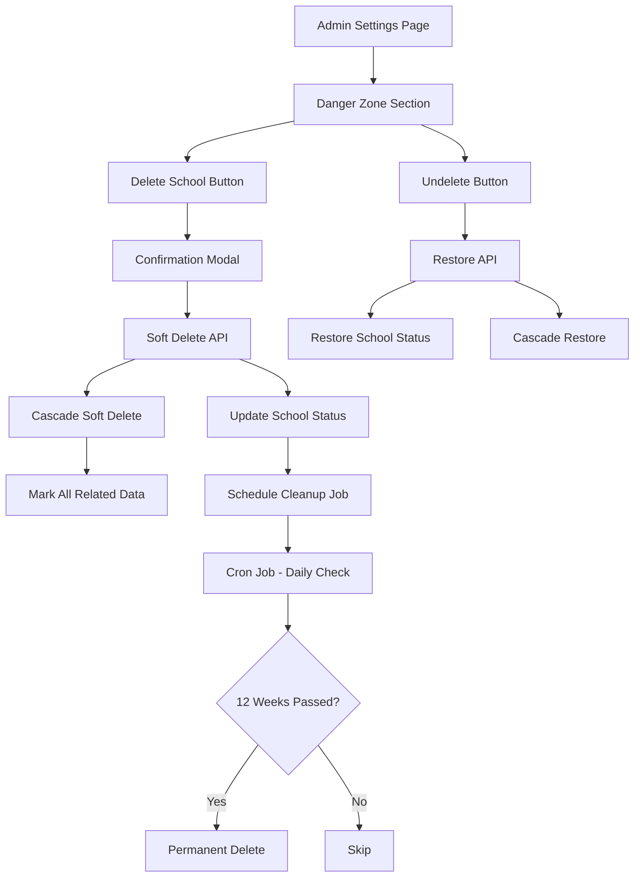
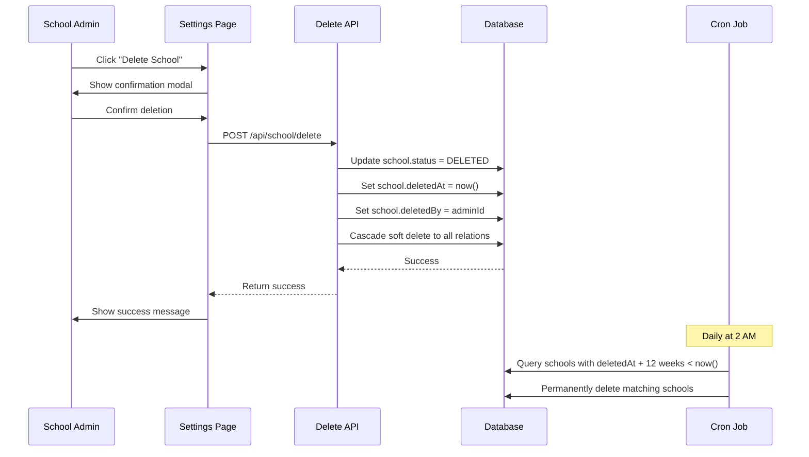

# Design Document: School Deletion Danger Zone

## Overview

The School Deletion Danger Zone feature provides school administrators with the ability to soft-delete their entire school and all associated data with a 12-week grace period. This critical administrative function implements a two-phase deletion process: an initial soft-delete (cold delete) that marks the school and all related data as deleted while preserving it for 12 weeks, followed by automatic permanent deletion if not restored. During the grace period, administrators can undelete the school to restore full functionality. This feature addresses the need for safe school account closure while providing a safety net against accidental deletions.

The implementation requires careful consideration of data integrity, cascading soft-deletes across all related entities, scheduled cleanup jobs, and clear user interface warnings. The feature will be integrated into the existing admin settings page as a new "Danger Zone" section, following established patterns for critical administrative actions.

## Architecture



## Sequence Diagrams

### Soft Delete Flow



````

### Undelete Flow

```mermaid
sequenceDiagram
    participant Admin as School Admin
    participant UI as Settings Page
    participant API as Restore API
    participant DB as Database

    Admin->>UI: Click "Restore School"
    UI->>Admin: Show confirmation modal
    Admin->>UI: Confirm restoration
    UI->>API: POST /api/school/restore
    API->>DB: Update school.status = ACTIVE
    API->>DB: Clear school.deletedAt
    API->>DB: Clear school.deletedBy
    API->>DB: Cascade restore to all relations
    DB-->>API: Success
    API-->>UI: Return success
    UI->>Admin: Show success message
````

## Components and Interfaces

### Component 1: DangerZoneSection

**Purpose**: UI component that displays the danger zone section in admin settings with delete and restore functionality

**Interface**:

```typescript
interface DangerZoneSectionProps {
  schoolStatus: AccountStatus;
  deletedAt?: Date | null;
  onDeleteSuccess: () => void;
  onRestoreSuccess: () => void;
}

interface DangerZoneSection extends React.FC<DangerZoneSectionProps> {}
```

**Responsibilities**:

- Display warning UI with appropriate styling
- Show delete button when school is active
- Show restore button with countdown when school is soft-deleted
- Handle confirmation modals for both actions
- Display remaining time in grace period
- Trigger API calls for delete/restore operations

### Component 2: DeleteConfirmationModal

**Purpose**: Modal dialog that confirms school deletion with strong warnings

**Interface**:

```typescript
interface DeleteConfirmationModalProps {
  isOpen: boolean;
  onClose: () => void;
  onConfirm: () => Promise<void>;
  schoolName: string;
}

interface DeleteConfirmationModal extends React.FC<DeleteConfirmationModalProps> {}
```

**Responsibilities**:

- Display critical warning messages
- Require explicit confirmation (e.g., typing school name)
- Show consequences of deletion
- Prevent accidental clicks
- Handle loading states during deletion

### Component 3: RestoreConfirmationModal

**Purpose**: Modal dialog that confirms school restoration

**Interface**:

```typescript
interface RestoreConfirmationModalProps {
  isOpen: boolean;
  onClose: () => void;
  onConfirm: () => Promise<void>;
  schoolName: string;
  daysRemaining: number;
}

interface RestoreConfirmationModal extends React.FC<RestoreConfirmationModalProps> {}
```

**Responsibilities**:

- Display restoration confirmation
- Show days remaining in grace period
- Handle loading states during restoration
- Provide clear success feedback

## Data Models

### School Model Updates

```typescript
// Existing fields in School model (from Prisma schema)
interface School {
  id: string;
  name: string;
  code: string;
  // ... other existing fields

  // Account lifecycle fields - Already exist in schema
  isActive: boolean;
  createdAt: Date;
  updatedAt: Date;
}

// Note: The User model already has these fields:
// status: AccountStatus (ACTIVE | SUSPENDED | DELETED)
// deletedAt: Date | null
// deletedBy: string | null
// suspendedAt: Date | null
// suspendedBy: string | null

// We need to add similar fields to School model
interface SchoolWithDeletionFields extends School {
  status: AccountStatus; // ACTIVE | SUSPENDED | DELETED
  deletedAt: Date | null;
  deletedBy: string | null; // User ID who performed deletion
  scheduledDeletionAt: Date | null; // When permanent deletion will occur
}
```

**Validation Rules**:

- status must be one of: ACTIVE, SUSPENDED, DELETED
- deletedAt must be set when status is DELETED
- deletedBy must reference a valid User ID
- scheduledDeletionAt must be deletedAt + 12 weeks
- Only SCHOOL_ADMIN or SUPER_ADMIN can perform deletion
- School cannot be deleted if already deleted

### API Response Types

```typescript
interface DeleteSchoolResponse {
  success: boolean;
  message: string;
  deletedAt: Date;
  scheduledDeletionAt: Date;
  daysRemaining: number;
}

interface RestoreSchoolResponse {
  success: boolean;
  message: string;
  restoredAt: Date;
}

interface SchoolStatusResponse {
  status: AccountStatus;
  deletedAt: Date | null;
  scheduledDeletionAt: Date | null;
  daysRemaining: number | null;
  canRestore: boolean;
}
```

## Main Algorithm/Workflow

````mermaid
sequenceDiagram
    participant UI as UI Component
    particip


## Key Functions with Formal Specifications

### Function 1: softDeleteSchool()

```typescript
async function softDeleteSchool(
  schoolId: string,
  deletedBy: string
): Promise<DeleteSchoolResponse>
````

**Preconditions:**

- `schoolId` is a valid ObjectId and references an existing school
- `deletedBy` is a valid User ID with SCHOOL_ADMIN or SUPER_ADMIN role
- School status is currently ACTIVE (not already deleted or suspended)
- User performing deletion belongs to the school being deleted

**Postconditions:**

- School status is set to DELETED
- `deletedAt` timestamp is set to current time
- `deletedBy` is set to the user ID
- `scheduledDeletionAt` is set to `deletedAt + 12 weeks`
- All related data is marked with soft delete flags (cascading)
- Returns success response with deletion details
- School becomes inaccessible to all users except for restoration

**Loop Invariants:** N/A (no loops in main function)

### Function 2: restoreSchool()

```typescript
async function restoreSchool(
  schoolId: string,
  restoredBy: string,
): Promise<RestoreSchoolResponse>;
```

**Preconditions:**

- `schoolId` is a valid ObjectId and references an existing school
- `restoredBy` is a valid User ID with SCHOOL_ADMIN or SUPER_ADMIN role
- School status is currently DELETED
- Current time is before `scheduledDeletionAt` (within 12-week grace period)
- User performing restoration has access to the deleted school

**Postconditions:**

- School status is set to ACTIVE
- `deletedAt` is set to null
- `deletedBy` is set to null
- `scheduledDeletionAt` is set to null
- All related data soft delete flags are cleared (cascading)
- Returns success response with restoration details
- School becomes fully accessible again

**Loop Invariants:** N/A (no loops in main function)

### Function 3: permanentlyDeleteSchool()

```typescript
async function permanentlyDeleteSchool(schoolId: string): Promise<void>;
```

**Preconditions:**

- `schoolId` is a valid ObjectId and references an existing school
- School status is DELETED
- Current time is >= `scheduledDeletionAt` (12 weeks have passed)
- Function is called by automated cron job only

**Postconditions:**

- School record is permanently removed from database
- All related data is permanently removed (cascading hard delete)
- No data recovery is possible
- Operation is logged in system audit trail

**Loop Invariants:**

- For cascading deletion loop: All previously deleted related records remain deleted
- Deletion order maintains referential integrity (children before parents)

### Function 4: cascadeSoftDelete()

```typescript
async function cascadeSoftDelete(
  schoolId: string,
  deletedAt: Date,
  deletedBy: string,
): Promise<void>;
```

**Preconditions:**

- `schoolId` is a valid ObjectId
- `deletedAt` is a valid timestamp
- `deletedBy` is a valid User ID
- School has been marked as deleted

**Postconditions:**

- All User records with matching schoolId have status set to DELETED
- All related entity records are marked with appropriate soft delete flags
- Deletion cascades to all child relationships defined in Prisma schema
- No data is physically removed from database
- All timestamps and user references are consistently set

**Loop Invariants:**

- For each model in cascade list: All previously processed models remain marked as deleted
- Referential integrity is maintained throughout cascade operation

### Function 5: calculateDaysRemaining()

```typescript
function calculateDaysRemaining(
  deletedAt: Date,
  scheduledDeletionAt: Date,
): number;
```

**Preconditions:**

- `deletedAt` is a valid past or present timestamp
- `scheduledDeletionAt` is a valid future timestamp
- `scheduledDeletionAt` > `deletedAt`

**Postconditions:**

- Returns integer representing days remaining until permanent deletion
- Returns 0 if current time >= scheduledDeletionAt
- Returns positive integer if within grace period
- Calculation is accurate to the day

**Loop Invariants:** N/A (pure calculation function)

## Algorithmic Pseudocode

### Main Soft Delete Algorithm

```typescript
ALGORITHM softDeleteSchool(schoolId, deletedBy)
INPUT: schoolId (string), deletedBy (string)
OUTPUT: DeleteSchoolResponse

BEGIN
  // Validate preconditions
  ASSERT schoolExists(schoolId) = true
  ASSERT userHasPermission(deletedBy, 'DELETE_SCHOOL') = true

  school ← fetchSchool(schoolId)
  ASSERT school.status = ACTIVE

  // Calculate deletion timestamps
  deletedAt ← getCurrentTimestamp()
  scheduledDeletionAt ← addWeeks(deletedAt, 12)

  // Begin transaction
  BEGIN TRANSACTION
    // Update school record
    UPDATE School
    SET status = DELETED,
        deletedAt = deletedAt,
        deletedBy = deletedBy,
        scheduledDeletionAt = scheduledDeletionAt,
        isActive = false
    WHERE id = schoolId

    // Cascade soft delete to all related data
    CALL cascadeSoftDelete(schoolId, deletedAt, deletedBy)

    // Log the action
    CALL createAuditLog({
      action: 'SCHOOL_SOFT_DELETE',
      schoolId: schoolId,
      performedBy: deletedBy,
      timestamp: deletedAt
    })
  COMMIT TRANSACTION

  // Calculate days remaining
  daysRemaining ← calculateDaysRemaining(deletedAt, scheduledDeletionAt)

  // Return success response
  RETURN {
    success: true,
    message: 'School scheduled for deletion',
    deletedAt: deletedAt,
    scheduledDeletionAt: scheduledDeletionAt,
    daysRemaining: daysRemaining
  }
END
```

**Preconditions:**

- schoolId references an existing active school
- deletedBy has appropriate permissions
- Database connection is available

**Postconditions:**

- School and all related data are soft-deleted
- Audit log entry is created
- Transaction is committed successfully

**Loop Invariants:** N/A (no explicit loops in main algorithm)

### Cascade Soft Delete Algorithm

```typescript
ALGORITHM cascadeSoftDelete(schoolId, deletedAt, deletedBy)
INPUT: schoolId (string), deletedAt (Date), deletedBy (string)
OUTPUT: void

BEGIN
  // Define all models that need cascading soft delete
  relatedModels ← [
    'User', 'Student', 'Staff', 'Teacher', 'Guardian',
    'AcademicYear', 'Term', 'Class', 'Stream', 'Subject',
    'Exam', 'Mark', 'Result', 'Attendance', 'Payment',
    'Message', 'Announcement', 'FeeStructure', 'Invoice',
    // ... all other related models from schema
  ]

  // Iterate through each model and apply soft delete
  FOR EACH model IN relatedModels DO
    ASSERT allPreviousModelsDeleted(relatedModels, currentIndex)

    IF model HAS status field THEN
      UPDATE model
      SET status = DELETED,
          deletedAt = deletedAt,
          deletedBy = deletedBy
      WHERE schoolId = schoolId
    ELSE IF model HAS isActive field THEN
      UPDATE model
      SET isActive = false,
          deletedAt = deletedAt,
          deletedBy = deletedBy
      WHERE schoolId = schoolId
    ELSE
      // For models without status/isActive, add soft delete fields
      UPDATE model
      SET deletedAt = deletedAt,
          deletedBy = deletedBy
      WHERE schoolId = schoolId
    END IF
  END FOR

  ASSERT allRelatedDataMarkedDeleted(schoolId)
END
```

**Preconditions:**

- schoolId is valid
- deletedAt and deletedBy are valid
- All models in relatedModels list exist in database schema

**Postconditions:**

- All records related to schoolId are marked as deleted
- Soft delete fields are consistently set across all models
- No data is physically removed

**Loop Invariants:**

- All previously processed models in the iteration remain marked as deleted
- Database consistency is maintained at each iteration

### Restore School Algorithm

```typescript
ALGORITHM restoreSchool(schoolId, restoredBy)
INPUT: schoolId (string), restoredBy (string)
OUTPUT: RestoreSchoolResponse

BEGIN
  // Validate preconditions
  ASSERT schoolExists(schoolId) = true
  ASSERT userHasPermission(restoredBy, 'RESTORE_SCHOOL') = true

  school ← fetchSchool(schoolId)
  ASSERT school.status = DELETED

  currentTime ← getCurrentTimestamp()
  ASSERT currentTime < school.scheduledDeletionAt

  // Begin transaction
  BEGIN TRANSACTION
    // Restore school record
    UPDATE School
    SET status = ACTIVE,
        deletedAt = null,
        deletedBy = null,
        scheduledDeletionAt = null,
        isActive = true
    WHERE id = schoolId

    // Cascade restore to all related data
    CALL cascadeRestore(schoolId)

    // Log the action
    CALL createAuditLog({
      action: 'SCHOOL_RESTORED',
      schoolId: schoolId,
      performedBy: restoredBy,
      timestamp: currentTime
    })
  COMMIT TRANSACTION

  // Return success response
  RETURN {
    success: true,
    message: 'School successfully restored',
    restoredAt: currentTime
  }
END
```

**Preconditions:**

- schoolId references an existing deleted school
- restoredBy has appropriate permissions
- Current time is within grace period

**Postconditions:**

- School and all related data are restored to active status
- All soft delete fields are cleared
- Audit log entry is created

**Loop Invariants:** N/A

### Permanent Delete Cron Job Algorithm

```typescript
ALGORITHM permanentDeleteCronJob()
INPUT: none (scheduled job)
OUTPUT: void

BEGIN
  currentTime ← getCurrentTimestamp()

  // Find all schools scheduled for permanent deletion
  schoolsToDelete ← QUERY School
    WHERE status = DELETED
    AND scheduledDeletionAt <= currentTime

  // Process each school for permanent deletion
  FOR EACH school IN schoolsToDelete DO
    ASSERT school.status = DELETED
    ASSERT school.scheduledDeletionAt <= currentTime

    BEGIN TRANSACTION
      // Log before deletion
      CALL createAuditLog({
        action: 'SCHOOL_PERMANENT_DELETE',
        schoolId: school.id,
        performedBy: 'SYSTEM',
        timestamp: currentTime,
        metadata: {
          originalDeletedAt: school.deletedAt,
          scheduledDeletionAt: school.scheduledDeletionAt
        }
      })

      // Permanently delete all related data (hard delete)
      CALL cascadePermanentDelete(school.id)

      // Finally, delete the school record itself
      DELETE FROM School WHERE id = school.id

    COMMIT TRANSACTION

    // Log successful deletion
    CALL logToSystemMonitor({
      level: 'INFO',
      message: `School ${school.id} permanently deleted`,
      timestamp: currentTime
    })
  END FOR

  // Report summary
  CALL logToSystemMonitor({
    level: 'INFO',
    message: `Permanent deletion job completed: ${schoolsToDelete.length} schools deleted`,
    timestamp: currentTime
  })
END
```

**Preconditions:**

- Cron job is scheduled to run daily
- Database connection is available
- System has appropriate permissions for deletion

**Postconditions:**

- All schools past grace period are permanently deleted
- All related data is permanently removed
- Audit logs are created before deletion
- System logs record the operation

**Loop Invariants:**

- For each school in iteration: All previously deleted schools remain deleted
- Audit logs are created before each deletion
- Transaction integrity is maintained for each school deletion

## Example Usage

### Frontend Component Usage

```typescript
// DangerZoneSection component in settings page
import { DangerZoneSection } from '@/components/settings/danger-zone-section'

export default function SettingsPage() {
  const { data: school } = useSchool()

  const handleDeleteSuccess = () => {
    toast.success('School scheduled for deletion')
    router.push('/deletion-notice')
  }

  const handleRestoreSuccess = () => {
    toast.success('School successfully restored')
    router.refresh()
  }

  return (
    <div className="space-y-6">
      {/* Other settings sections */}

      <DangerZoneSection
        schoolStatus={school.status}
        deletedAt={school.deletedAt}
        onDeleteSuccess={handleDeleteSuccess}
        onRestoreSuccess={handleRestoreSuccess}
      />
    </div>
  )
}
```

### API Route Usage

```typescript
// app/api/school/delete/route.ts
import { softDeleteSchool } from "@/lib/school-deletion";

export async function POST(request: Request) {
  const session = await getServerSession();

  if (!session?.user?.id) {
    return NextResponse.json({ error: "Unauthorized" }, { status: 401 });
  }

  if (!["SCHOOL_ADMIN", "SUPER_ADMIN"].includes(session.user.role)) {
    return NextResponse.json({ error: "Forbidden" }, { status: 403 });
  }

  try {
    const result = await softDeleteSchool(
      session.user.schoolId,
      session.user.id,
    );

    return NextResponse.json(result);
  } catch (error) {
    return NextResponse.json(
      { error: "Failed to delete school" },
      { status: 500 },
    );
  }
}
```

### Cron Job Setup

```typescript
// scripts/cron/permanent-delete-schools.ts
import cron from "node-cron";
import { permanentDeleteCronJob } from "@/lib/school-deletion";

// Run daily at 2:00 AM
cron.schedule("0 2 * * *", async () => {
  console.log("Running permanent school deletion job...");

  try {
    await permanentDeleteCronJob();
    console.log("Permanent deletion job completed successfully");
  } catch (error) {
    console.error("Permanent deletion job failed:", error);
    // Send alert to system administrators
  }
});
```

## Correctness Properties

### Universal Quantification Statements

1. **Soft Delete Atomicity**: ∀ school deletion operations, either all related data is marked as deleted OR no data is marked as deleted (transaction atomicity)

2. **Grace Period Guarantee**: ∀ soft-deleted schools, permanent deletion occurs if and only if current_time >= deletedAt + 12 weeks

3. **Restoration Window**: ∀ deleted schools, restoration is possible if and only if current_time < scheduledDeletionAt

4. **Cascade Consistency**: ∀ schools with status = DELETED, all related records (users, students, etc.) must also be marked as deleted

5. **Permission Enforcement**: ∀ deletion/restoration operations, the performing user must have role ∈ {SCHOOL_ADMIN, SUPER_ADMIN}

6. **Audit Trail Completeness**: ∀ deletion and restoration operations, an audit log entry must exist with timestamp, performer, and action type

7. **Data Integrity**: ∀ soft-deleted records, original data remains unchanged except for status/deletion fields

8. **Irreversibility After Grace Period**: ∀ schools where current_time >= scheduledDeletionAt, restoration is impossible and permanent deletion is guaranteed

9. **Single Active Status**: ∀ schools, status ∈ {ACTIVE, SUSPENDED, DELETED} (exactly one status at any time)

10. **Timestamp Consistency**: ∀ deleted schools, deletedAt < scheduledDeletionAt AND scheduledDeletionAt = deletedAt + 84 days

### Property-Based Test Assertions

```typescript
// Property 1: Soft delete is reversible within grace period
property("soft delete is reversible within grace period", () => {
  const school = createTestSchool();
  const deletedSchool = softDeleteSchool(school.id, adminId);

  assert(deletedSchool.status === "DELETED");
  assert(deletedSchool.deletedAt !== null);

  const restoredSchool = restoreSchool(school.id, adminId);

  assert(restoredSchool.status === "ACTIVE");
  assert(restoredSchool.deletedAt === null);
  assert(restoredSchool.id === school.id);
});

// Property 2: Cascade delete affects all related records
property("cascade delete marks all related records", () => {
  const school = createTestSchoolWithData();
  const relatedCounts = countRelatedRecords(school.id);

  softDeleteSchool(school.id, adminId);

  const deletedCounts = countDeletedRelatedRecords(school.id);

  assert(deletedCounts.users === relatedCounts.users);
  assert(deletedCounts.students === relatedCounts.students);
  assert(deletedCounts.staff === relatedCounts.staff);
  // ... assert for all related models
});

// Property 3: Permanent deletion removes all data
property("permanent deletion removes all data", () => {
  const school = createTestSchool();
  softDeleteSchool(school.id, adminId);

  // Simulate 12 weeks passing
  advanceTime(84, "days");

  permanentlyDeleteSchool(school.id);

  assert(schoolExists(school.id) === false);
  assert(countRelatedRecords(school.id) === 0);
});

// Property 4: Days remaining calculation is accurate
property("days remaining calculation is accurate", () => {
  const school = createTestSchool();
  const result = softDeleteSchool(school.id, adminId);

  assert(result.daysRemaining === 84);

  advanceTime(10, "days");
  const status = getSchoolStatus(school.id);

  assert(status.daysRemaining === 74);
});
```

## Error Handling

### Error Scenario 1: School Already Deleted

**Condition**: User attempts to delete a school that is already in DELETED status
**Response**: Return 400 Bad Request with error message "School is already scheduled for deletion"
**Recovery**: Display current deletion status and scheduled deletion date to user

### Error Scenario 2: Unauthorized Deletion Attempt

**Condition**: User without SCHOOL_ADMIN or SUPER_ADMIN role attempts deletion
**Response**: Return 403 Forbidden with error message "Insufficient permissions to delete school"
**Recovery**: Log security event and display permission error to user

### Error Scenario 3: Grace Period Expired

**Condition**: User attempts to restore school after scheduledDeletionAt has passed
**Response**: Return 410 Gone with error message "Grace period has expired, school cannot be restored"
**Recovery**: Inform user that data is permanently deleted or will be deleted soon

### Error Scenario 4: Database Transaction Failure

**Condition**: Database transaction fails during soft delete or restore operation
**Response**: Rollback all changes, return 500 Internal Server Error
**Recovery**: Log error details, ensure no partial state changes, allow user to retry

### Error Scenario 5: Cascade Operation Failure

**Condition**: Cascading soft delete fails on a related model
**Response**: Rollback entire transaction, return 500 Internal Server Error with details
**Recovery**: Log which model failed, ensure atomicity, investigate data integrity

### Error Scenario 6: Cron Job Failure

**Condition**: Permanent deletion cron job encounters error
**Response**: Log error, send alert to system administrators, skip failed school
**Recovery**: Retry on next scheduled run, investigate and fix underlying issue

### Error Scenario 7: Missing Required Fields

**Condition**: School record missing status, deletedAt, or other required fields
**Response**: Return 422 Unprocessable Entity with validation errors
**Recovery**: Add migration to populate missing fields, prevent future occurrences

## Testing Strategy

### Unit Testing Approach

**Core Functions to Test**:

- `softDeleteSchool()` - Verify status updates, timestamp setting, and return values
- `restoreSchool()` - Verify restoration logic and field clearing
- `cascadeSoftDelete()` - Verify all related models are marked as deleted
- `cascadeRestore()` - Verify all related models are restored
- `calculateDaysRemaining()` - Verify date calculations with various inputs
- `permanentlyDeleteSchool()` - Verify hard deletion logic

**Test Cases**:

1. Soft delete with valid inputs returns success
2. Soft delete sets all required fields correctly
3. Soft delete with already deleted school returns error
4. Restore with valid inputs returns success
5. Restore clears all deletion fields
6. Restore after grace period returns error
7. Calculate days remaining with various date ranges
8. Permanent delete removes all records
9. Permission checks prevent unauthorized operations
10. Transaction rollback on failure

**Coverage Goals**: 90%+ code coverage for all deletion-related functions

### Property-Based Testing Approach

**Property Test Library**: fast-check (for TypeScript/JavaScript)

**Properties to Test**:

1. **Idempotency of Soft Delete**: Calling softDeleteSchool multiple times on the same school should have the same effect as calling it once (after first call returns error)

2. **Reversibility Within Grace Period**: For any school soft-deleted within the grace period, restoration should return the school to ACTIVE status with all deletion fields cleared

3. **Cascade Completeness**: For any school with N related records, soft delete should mark exactly N related records as deleted

4. **Time Calculation Accuracy**: For any deletedAt timestamp, scheduledDeletionAt should always equal deletedAt + 84 days

5. **Status Transition Validity**: School status can only transition: ACTIVE → DELETED → (ACTIVE or permanently deleted), never other paths

6. **Audit Trail Existence**: For any deletion or restoration operation, exactly one audit log entry should exist

**Property Test Examples**:

```typescript
import fc from "fast-check";

describe("School Deletion Properties", () => {
  it("soft delete is idempotent after first success", () => {
    fc.assert(
      fc.property(fc.string(), fc.string(), async (schoolId, adminId) => {
        const school = await createTestSchool(schoolId);
        const result1 = await softDeleteSchool(schoolId, adminId);
        const result2 = await softDeleteSchool(schoolId, adminId);

        expect(result2.success).toBe(false);
        expect(result2.error).toContain("already deleted");
      }),
    );
  });

  it("days remaining decreases linearly with time", () => {
    fc.assert(
      fc.property(
        fc.date(),
        fc.integer({ min: 0, max: 83 }),
        (deletedAt, daysElapsed) => {
          const scheduledDeletionAt = addDays(deletedAt, 84);
          const currentDate = addDays(deletedAt, daysElapsed);

          const remaining = calculateDaysRemaining(
            deletedAt,
            scheduledDeletionAt,
            currentDate,
          );

          expect(remaining).toBe(84 - daysElapsed);
        },
      ),
    );
  });

  it("cascade delete marks all related records", () => {
    fc.assert(
      fc.property(
        fc.integer({ min: 1, max: 100 }),
        fc.integer({ min: 1, max: 50 }),
        async (studentCount, staffCount) => {
          const school = await createSchoolWithData({
            students: studentCount,
            staff: staffCount,
          });

          await softDeleteSchool(school.id, adminId);

          const deletedStudents = await countDeletedStudents(school.id);
          const deletedStaff = await countDeletedStaff(school.id);

          expect(deletedStudents).toBe(studentCount);
          expect(deletedStaff).toBe(staffCount);
        },
      ),
    );
  });
});
```

### Integration Testing Approach

**Integration Test Scenarios**:

1. **End-to-End Soft Delete Flow**:
   - Admin clicks delete button
   - Confirmation modal appears
   - Admin confirms deletion
   - API call succeeds
   - UI updates to show deletion status
   - Database reflects soft delete

2. **End-to-End Restore Flow**:
   - Admin views deleted school
   - Clicks restore button
   - Confirms restoration
   - API call succeeds
   - UI updates to show active status
   - Database reflects restoration

3. **Cron Job Execution**:
   - Create schools with expired grace periods
   - Trigger cron job manually
   - Verify schools are permanently deleted
   - Verify audit logs are created

4. **Permission Enforcement**:
   - Attempt deletion as non-admin user
   - Verify 403 Forbidden response
   - Verify no database changes

5. **Transaction Rollback**:
   - Simulate database error during cascade
   - Verify no partial state changes
   - Verify school remains in original state

**Test Environment**: Separate test database with seed data

**Tools**: Vitest for test runner, Prisma test client, supertest for API testing

## Performance Considerations

### Cascade Operation Performance

**Challenge**: Soft-deleting a school with thousands of related records could be slow

**Optimization Strategies**:

1. Use batch updates instead of individual record updates
2. Implement database indexes on schoolId fields for all related models
3. Use Prisma's `updateMany` for bulk operations
4. Consider background job for very large schools (>10,000 students)

**Expected Performance**:

- Small school (<500 students): <2 seconds
- Medium school (500-2000 students): 2-5 seconds
- Large school (>2000 students): 5-15 seconds

### Cron Job Performance

**Challenge**: Processing multiple schools for permanent deletion could take time

**Optimization Strategies**:

1. Process schools in batches (e.g., 10 at a time)
2. Use parallel processing for independent deletions
3. Implement timeout limits per school
4. Log progress for monitoring

**Expected Performance**:

- Process up to 100 schools per run
- Maximum 30 minutes execution time
- Retry failed deletions on next run

### Database Query Optimization

**Indexes Required**:

```sql
CREATE INDEX idx_school_status ON School(status)
CREATE INDEX idx_school_scheduled_deletion ON School(scheduledDeletionAt)
CREATE INDEX idx_school_deleted_at ON School(deletedAt)
CREATE INDEX idx_user_school_status ON User(schoolId, status)
CREATE INDEX idx_student_school_status ON Student(schoolId, status)
-- Similar indexes for all related models
```

## Security Considerations

### Authentication and Authorization

**Requirements**:

1. Only SCHOOL_ADMIN and SUPER_ADMIN roles can delete schools
2. User must belong to the school being deleted (except SUPER_ADMIN)
3. Session must be valid and not expired
4. Multi-factor authentication recommended for deletion operations

**Implementation**:

```typescript
async function validateDeletionPermission(
  userId: string,
  schoolId: string,
): Promise<boolean> {
  const user = await prisma.user.findUnique({
    where: { id: userId },
    include: { school: true },
  });

  if (!user) return false;

  // Super admin can delete any school
  if (user.role === "SUPER_ADMIN") return true;

  // School admin can only delete their own school
  if (user.role === "SCHOOL_ADMIN" && user.schoolId === schoolId) {
    return true;
  }

  return false;
}
```

### Audit Trail

**Requirements**:

1. Log all deletion attempts (successful and failed)
2. Record user ID, timestamp, IP address, and action
3. Store audit logs separately from school data (survive permanent deletion)
4. Retain audit logs for minimum 7 years for compliance

**Audit Log Structure**:

```typescript
interface SchoolDeletionAuditLog {
  id: string;
  action:
    | "SOFT_DELETE"
    | "RESTORE"
    | "PERMANENT_DELETE"
    | "DELETE_ATTEMPT_FAILED";
  schoolId: string;
  schoolName: string;
  performedBy: string;
  performedByEmail: string;
  ipAddress: string;
  userAgent: string;
  timestamp: Date;
  metadata: {
    deletedAt?: Date;
    scheduledDeletionAt?: Date;
    failureReason?: string;
  };
}
```

### Data Protection

**Requirements**:

1. Soft-deleted data must remain encrypted at rest
2. Access to soft-deleted schools must be restricted
3. Permanent deletion must be irreversible and complete
4. Comply with GDPR "right to be forgotten" requirements

**Implementation Notes**:

- Soft-deleted schools should not appear in normal queries
- Add `WHERE status != 'DELETED'` to all school queries
- Implement data export before deletion for compliance
- Verify all related data is removed during permanent deletion

### Rate Limiting

**Requirements**:

1. Limit deletion attempts to prevent abuse
2. Implement cooldown period between deletion attempts
3. Alert administrators of suspicious deletion patterns

**Implementation**:

```typescript
const DELETION_RATE_LIMIT = {
  maxAttempts: 3,
  windowMinutes: 60,
  cooldownMinutes: 30,
};

async function checkDeletionRateLimit(userId: string): Promise<boolean> {
  const recentAttempts = await prisma.auditLog.count({
    where: {
      performedBy: userId,
      action: "SCHOOL_SOFT_DELETE",
      timestamp: {
        gte: subMinutes(new Date(), DELETION_RATE_LIMIT.windowMinutes),
      },
    },
  });

  return recentAttempts < DELETION_RATE_LIMIT.maxAttempts;
}
```

## Dependencies

### External Libraries

1. **Prisma ORM** (v5.x): Database operations and schema management
2. **node-cron** (v3.x): Scheduling permanent deletion job
3. **date-fns** (v2.x): Date calculations and formatting
4. **zod** (v3.x): Input validation and type safety
5. **next-auth** (v4.x): Authentication and session management

### Internal Dependencies

1. **Audit Log Service**: For recording all deletion operations
2. **Permission Service**: For role-based access control
3. **Notification Service**: For sending deletion/restoration confirmations
4. **Email Service**: For sending grace period reminders
5. **Database Service**: For transaction management

### Database Schema Changes

**Required Prisma Schema Updates**:

```prisma
model School {
  // ... existing fields

  // Add these fields for soft deletion
  status             AccountStatus @default(ACTIVE)
  deletedAt          DateTime?
  deletedBy          String?       @db.ObjectId
  scheduledDeletionAt DateTime?

  // ... existing relations
}

// Ensure AccountStatus enum includes DELETED
enum AccountStatus {
  ACTIVE
  SUSPENDED
  DELETED
}
```

**Migration Steps**:

1. Add new fields to School model
2. Create database migration
3. Run migration on staging environment
4. Test soft delete functionality
5. Deploy to production with zero downtime

### Infrastructure Requirements

1. **Cron Job Scheduler**: Node.js process or cloud scheduler (e.g., Vercel Cron, AWS EventBridge)
2. **Database Backups**: Daily backups before permanent deletions
3. **Monitoring**: Alert system for failed deletions or cron job failures
4. **Logging**: Centralized logging for audit trail (e.g., CloudWatch, Datadog)

### API Endpoints

**New Endpoints Required**:

1. `POST /api/school/delete` - Soft delete school
2. `POST /api/school/restore` - Restore deleted school
3. `GET /api/school/status` - Get deletion status and days remaining
4. `GET /api/school/deletion-preview` - Preview what will be deleted (for confirmation modal)

**Existing Endpoints to Update**:

1. All school query endpoints - Add `WHERE status != 'DELETED'` filter
2. Authentication endpoints - Prevent login to deleted schools
3. Dashboard endpoints - Show deletion notice for deleted schools
