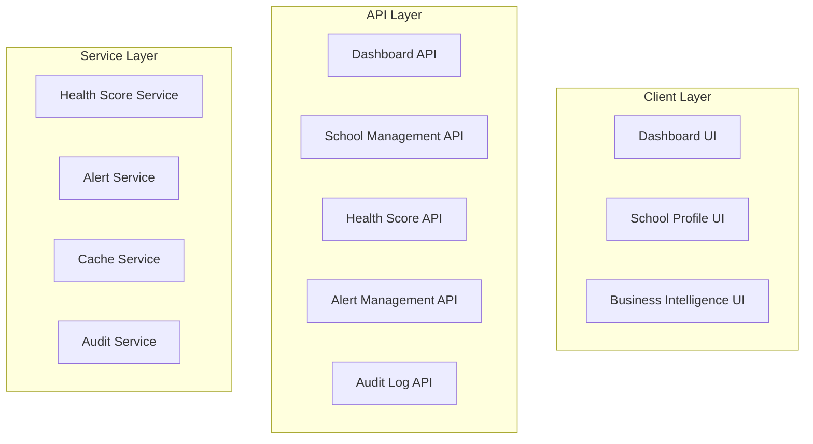

# Design Document: Super Admin Schools Control Center

## Overview

The Super Admin Schools Control Center is a mission-critical dashboard that transforms school oversight from passive monitoring into active strategic control. This system provides super administrators with real-time visibility into school health, proactive intervention capabilities, and comprehensive management tools to prevent churn and protect revenue.

The control center answers the critical question: "Which schools are alive, growing, paying, struggling, or about to churn?" in under 10 seconds through a sophisticated health scoring algorithm, automated alerting system, and powerful filtering capabilities.

### Key Capabilities

- **Real-time School Health Monitoring**: Instant assessment of all schools with color-coded health scores (0-100)
- **Proactive Churn Prevention**: Automated alerts for critical conditions (inactive admins, low SMS balance, payment issues)
- **Bulk Management Operations**: Multi-select actions for efficient school administration
- **Detailed School Profiles**: Comprehensive view of school status, metrics, and history
- **Global Control Actions**: Suspend, reactivate, impersonate, reset passwords, and more
- **Business Intelligence**: Aggregated metrics for platform-wide performance analysis
- **Complete Audit Trail**: Immutable logging of all administrative actions
- **Mobile Responsive**: Full functionality on mobile devices for on-the-go management

### Technical Context

- **Framework**: Next.js 14 with App Router
- **Language**: TypeScript
- **Database**: MongoDB via Prisma ORM
- **Authentication**: Role-based access control (SUPER_ADMIN role)
- **UI Components**: React with responsive design
- **Caching Strategy**: Multi-tier caching for optimal performance

## Architecture

### System Components



    subgraph "Background Jobs"
        HealthCalc[Health Score Calculator]
        AlertChecker[Alert Checker]
    end

    subgraph "Data Layer"
        SchoolDB[(School Data)]
        MetricsDB[(Metrics Data)]
        AuditDB[(Audit Logs)]
        CacheDB[(Redis Cache)]
    end

    Dashboard --> DashboardAPI
    SchoolProfile --> SchoolAPI
    BIView --> DashboardAPI

    DashboardAPI --> HealthService
    DashboardAPI --> CacheService
    SchoolAPI --> AuditService
    HealthAPI --> HealthService
    AlertAPI --> AlertService

    HealthService --> SchoolDB
    HealthService --> MetricsDB
    AlertService --> SchoolDB
    CacheService --> CacheDB
    AuditService --> AuditDB

    HealthCalc --> HealthService
    AlertChecker --> AlertService

````

### Data Flow

1. **Dashboard Load**: Client requests dashboard → API checks cache → Returns cached data or queries database → Caches result
2. **Health Score Calculation**: Background job runs daily → Calculates scores for all schools → Updates database → Invalidates cache
3. **Alert Generation**: Background job runs hourly → Checks conditions → Creates/updates alerts → Notifies super admins
4. **Control Actions**: User initiates action → API validates permissions → Executes action → Creates audit log → Updates school state
5. **Search/Filter**: User applies filters → API queries database with filters → Returns filtered results → Caches query

### Technology Stack

- **Frontend**: Next.js 14 App Router, React, TypeScript, TailwindCSS
- **Backend**: Next.js API Routes, TypeScript
- **Database**: MongoDB with Prisma ORM
- **Caching**: Redis (or in-memory cache for development)
- **Background Jobs**: Node.js cron jobs or queue system (Bull/BullMQ)
- **Authentication**: NextAuth.js with role-based access control

## Components and Interfaces

### 1. Dashboard Component

**Purpose**: Main interface displaying all schools with health metrics and filtering capabilities

**Props**:
```typescript
interface DashboardProps {
  initialData: SchoolListData;
  globalStats: GlobalStatistics;
}
````

**State Management**:

- Search query
- Active filters (plan, health range, payment status, activity status, alert flags)
- Selected schools (for bulk actions)
- Sort configuration
- Pagination state

**Key Features**:

- Global statistics cards (total schools, active, suspended, revenue, flagged)
- Search bar with real-time filtering
- Filter chips (stackable)
- School table with sortable columns
- Bulk action toolbar
- Pagination controls

### 2. School Profile Component

**Purpose**: Detailed view of a single school with all metrics and control actions

**Props**:

```typescript
interface SchoolProfileProps {
  schoolId: string;
  initialData: SchoolDetailData;
}
```

**Sections**:

- Header (name, health score, status badge, last activity)
- Quick actions (suspend, reactivate, change plan, reset password, force logout, impersonate)
- Core information (admin details, registration, plan)
- Usage metrics (students, teachers, classes, SMS)
- Financial metrics (MRR, revenue, payments, billing)
- Activity timeline (recent events)
- Alert flags (current warnings)
- Audit log (recent actions)

### 3. Business Intelligence Component

**Purpose**: Aggregated metrics and analytics across all schools

**Props**:

```typescript
interface BIProps {
  metrics: BusinessMetrics;
  dateRange: DateRange;
}
```

**Metrics Displayed**:

- Total MRR
- Average health score
- Churn rate (30-day)
- Revenue per school
- Health score distribution chart
- Plan distribution chart
- Alert distribution chart
- Trend graphs (MRR over time, health score trends)

### 4. Health Score Service

**Purpose**: Calculate and manage school health scores

**Interface**:

```typescript
interface HealthScoreService {
  calculateHealthScore(schoolId: string): Promise<HealthScore>;
  calculateAllHealthScores(): Promise<void>;
  getHealthScoreBreakdown(schoolId: string): Promise<HealthScoreBreakdown>;
}

interface HealthScore {
  schoolId: string;
  score: number; // 0-100
  activityScore: number; // 0-30
  dataCompletenessScore: number; // 0-20
  smsEngagementScore: number; // 0-20
  paymentDisciplineScore: number; // 0-20
  growthScore: number; // 0-10
  calculatedAt: Date;
}
```

**Calculation Algorithm**:

```
Total Score = Activity (30%) + Data Completeness (20%) + SMS Engagement (20%) + Payment Discipline (20%) + Growth (10%)

Activity Score (30 points):
- Login within 7 days: 30 points
- Login within 30 days: 15 points
- No login beyond 30 days: 0 points

Data Completeness Score (20 points):
- Calculate percentage of required fields populated
- Score = (populated_fields / total_required_fields) * 20
- Required fields: students, teachers, classes, schedules, fee structures

SMS Engagement Score (20 points):
- Calculate SMS usage ratio: messages_sent / student_count
- Optimal ratio: 3-5 messages per student per month
- Score = min(20, (usage_ratio / optimal_ratio) * 20)

Payment Discipline Score (20 points):
- Current payments (within due date): 20 points
- Payments within 7 days of due date: 10 points
- Overdue payments: 0 points

Growth Score (10 points):
- Calculate month-over-month student count change
- Positive growth: 10 points
- No change: 5 points
- Negative growth: 0 points
```

### 5. Alert Service

**Purpose**: Monitor schools and generate automated alerts

**Interface**:

```typescript
interface AlertService {
  checkAlerts(): Promise<void>;
  getSchoolAlerts(schoolId: string): Promise<Alert[]>;
  acknowledgeAlert(alertId: string, adminId: string): Promise<void>;
}

interface Alert {
  id: string;
  schoolId: string;
  type: AlertType;
  severity: "info" | "warning" | "critical";
  title: string;
  message: string;
  daysSinceCondition: number;
  createdAt: Date;
  acknowledgedAt?: Date;
}

enum AlertType {
  LOW_SMS = "LOW_SMS",
  INACTIVE_ADMIN = "INACTIVE_ADMIN",
  PAYMENT_OVERDUE = "PAYMENT_OVERDUE",
  CRITICAL_HEALTH = "CRITICAL_HEALTH",
  DECLINING_ENROLLMENT = "DECLINING_ENROLLMENT",
}
```

**Alert Conditions**:

- Low SMS: SMS balance < 100 messages
- Inactive Admin: No admin login for 14+ days
- Payment Overdue: Payment overdue by 7+ days
- Critical Health: Health score < 50
- Declining Enrollment: Student count decreased for 2 consecutive months

### 6. Audit Service

**Purpose**: Log all administrative actions immutably

**Interface**:

```typescript
interface AuditService {
  logAction(action: AuditAction): Promise<void>;
  getSchoolAuditLog(schoolId: string, limit?: number): Promise<AuditLog[]>;
  getGlobalAuditLog(filters: AuditFilters): Promise<AuditLog[]>;
}

interface AuditAction {
  adminId: string;
  actionType: ActionType;
  targetSchoolId: string;
  reason: string;
  metadata?: Record<string, any>;
}

interface AuditLog {
  id: string;
  timestamp: Date;
  adminId: string;
  adminName: string;
  actionType: ActionType;
  targetSchoolId: string;
  targetSchoolName: string;
  reason: string;
  result: "success" | "failure";
  metadata?: Record<string, any>;
}

enum ActionType {
  SUSPEND = "SUSPEND",
  REACTIVATE = "REACTIVATE",
  CHANGE_PLAN = "CHANGE_PLAN",
  RESET_PASSWORD = "RESET_PASSWORD",
  FORCE_LOGOUT = "FORCE_LOGOUT",
  IMPERSONATE = "IMPERSONATE",
  BULK_SUSPEND = "BULK_SUSPEND",
  BULK_REACTIVATE = "BULK_REACTIVATE",
}
```

## Data Models

### SchoolHealthMetrics

```typescript
interface SchoolHealthMetrics {
  id: string;
  schoolId: string;
  healthScore: number; // 0-100
  activityScore: number; // 0-30
  dataCompletenessScore: number; // 0-20
  smsEngagementScore: number; // 0-20
  paymentDisciplineScore: number; // 0-20
  growthScore: number; // 0-10
  lastAdminLogin: Date | null;
  studentCount: number;
  teacherCount: number;
  classCount: number;
  smsBalance: number;
  smsSentThisMonth: number;
  lastPaymentDate: Date | null;
  lastPaymentAmount: number;
  nextBillingDate: Date | null;
  mrr: number; // Monthly Recurring Revenue
  totalRevenue: number;
  calculatedAt: Date;
}
```

### SchoolAlert

```typescript
interface SchoolAlert {
  id: string;
  schoolId: string;
  type: AlertType;
  severity: "info" | "warning" | "critical";
  title: string;
  message: string;
  conditionStartedAt: Date;
  daysSinceCondition: number;
  isActive: boolean;
  acknowledgedAt: Date | null;
  acknowledgedBy: string | null;
  createdAt: Date;
  updatedAt: Date;
}
```

### SuperAdminAuditLog

```typescript
interface SuperAdminAuditLog {
  id: string;
  timestamp: Date;
  adminId: string;
  adminEmail: string;
  actionType: ActionType;
  targetSchoolId: string;
  targetSchoolName: string;
  reason: string;
  result: "success" | "failure";
  errorMessage: string | null;
  ipAddress: string;
  userAgent: string;
  metadata: Record<string, any>;
}
```

### Database Schema Extensions

**New Collections**:

1. **SchoolHealthMetrics**

```prisma
model SchoolHealthMetrics {
  id                      String   @id @default(auto()) @map("_id") @db.ObjectId
  schoolId                String   @unique @db.ObjectId
  healthScore             Int      // 0-100
  activityScore           Int      // 0-30
  dataCompletenessScore   Int      // 0-20
  smsEngagementScore      Int      // 0-20
  paymentDisciplineScore  Int      // 0-20
  growthScore             Int      // 0-10
  lastAdminLogin          DateTime?
  studentCount            Int
  teacherCount            Int
  classCount              Int
  smsBalance              Int
  smsSentThisMonth        Int
  lastPaymentDate         DateTime?
  lastPaymentAmount       Float
  nextBillingDate         DateTime?
  mrr                     Float
  totalRevenue            Float
  calculatedAt            DateTime @default(now())
  updatedAt               DateTime @updatedAt

  school School @relation(fields: [schoolId], references: [id], onDelete: Cascade)

  @@index([healthScore])
  @@index([calculatedAt])
}
```

2. **SchoolAlert**

```prisma
model SchoolAlert {
  id                  String   @id @default(auto()) @map("_id") @db.ObjectId
  schoolId            String   @db.ObjectId
  type                String   // AlertType enum
  severity            String   // 'info' | 'warning' | 'critical'
  title               String
  message             String
  conditionStartedAt  DateTime
  daysSinceCondition  Int
  isActive            Boolean  @default(true)
  acknowledgedAt      DateTime?
  acknowledgedBy      String?  @db.ObjectId
  createdAt           DateTime @default(now())
  updatedAt           DateTime @updatedAt

  school School @relation(fields: [schoolId], references: [id], onDelete: Cascade)

  @@index([schoolId])
  @@index([type])
  @@index([severity])
  @@index([isActive])
  @@index([conditionStartedAt])
}
```

3. **SuperAdminAuditLog**

```prisma
model SuperAdminAuditLog {
  id               String   @id @default(auto()) @map("_id") @db.ObjectId
  timestamp        DateTime @default(now())
  adminId          String   @db.ObjectId
  adminEmail       String
  actionType       String   // ActionType enum
  targetSchoolId   String   @db.ObjectId
  targetSchoolName String
  reason           String
  result           String   // 'success' | 'failure'
  errorMessage     String?
  ipAddress        String
  userAgent        String
  metadata         Json     @default("{}")

  @@index([adminId])
  @@index([actionType])
  @@index([targetSchoolId])
  @@index([timestamp])
}
```

**Existing Model Extensions**:

Update the `School` model to add relations:

```prisma
model School {
  // ... existing fields ...

  healthMetrics SchoolHealthMetrics?
  alerts        SchoolAlert[]

  // ... existing relations ...
}
```

### API Endpoints

**Dashboard Endpoints**:

- `GET /api/super-admin/dashboard` - Get dashboard data with global stats and school list
- `GET /api/super-admin/schools` - Get paginated school list with filters
- `GET /api/super-admin/schools/[id]` - Get detailed school profile
- `GET /api/super-admin/business-intelligence` - Get aggregated BI metrics

**School Management Endpoints**:

- `POST /api/super-admin/schools/[id]/suspend` - Suspend a school
- `POST /api/super-admin/schools/[id]/reactivate` - Reactivate a school
- `POST /api/super-admin/schools/[id]/change-plan` - Change school plan
- `POST /api/super-admin/schools/[id]/reset-password` - Reset admin password
- `POST /api/super-admin/schools/[id]/force-logout` - Force logout all sessions
- `POST /api/super-admin/schools/[id]/impersonate` - Impersonate school admin

**Bulk Action Endpoints**:

- `POST /api/super-admin/schools/bulk-suspend` - Suspend multiple schools
- `POST /api/super-admin/schools/bulk-reactivate` - Reactivate multiple schools
- `POST /api/super-admin/schools/bulk-notice` - Send notice to multiple schools

**Health & Alerts Endpoints**:

- `GET /api/super-admin/health-scores` - Get health scores for all schools
- `GET /api/super-admin/alerts` - Get all active alerts
- `POST /api/super-admin/alerts/[id]/acknowledge` - Acknowledge an alert

**Audit Endpoints**:

- `GET /api/super-admin/audit-log` - Get global audit log with filters
- `GET /api/super-admin/schools/[id]/audit-log` - Get school-specific audit log

### Caching Strategy

**Cache Layers**:

1. **Global Statistics Cache** (TTL: 5 minutes)
   - Key: `super-admin:global-stats`
   - Data: Total schools, active schools, suspended schools, total revenue, flagged schools

2. **School List Cache** (TTL: 1 minute)
   - Key: `super-admin:school-list:{filters-hash}`
   - Data: Paginated school list with health scores and basic metrics

3. **School Profile Cache** (TTL: 30 seconds)
   - Key: `super-admin:school:{schoolId}`
   - Data: Detailed school profile with all metrics

4. **Health Scores Cache** (TTL: 24 hours)
   - Key: `super-admin:health-scores`
   - Data: All school health scores (refreshed by background job)

5. **Business Intelligence Cache** (TTL: 5 minutes)
   - Key: `super-admin:bi-metrics`
   - Data: Aggregated BI metrics

**Cache Invalidation**:

- Health scores: Invalidated daily by background job
- School profile: Invalidated on any control action
- School list: Invalidated on school status change
- Global stats: Invalidated on school creation/deletion/status change

## Correctness Properties

A property is a characteristic or behavior that should hold true across all valid executions of a system—essentially, a formal statement about what the system should do. Properties serve as the bridge between human-readable specifications and machine-verifiable correctness guarantees.

### Property 1: Health Score Calculation Correctness

_For any_ school with valid metrics (last login date, data completeness percentage, SMS usage, payment status, student count history), the calculated health score should equal the weighted sum of: activity score (30%), data completeness score (20%), SMS engagement score (20%), payment discipline score (20%), and growth score (10%), where each component follows its specific scoring rules and the total is bounded between 0 and 100.

**Validates: Requirements 4.1, 4.2, 4.3, 4.4, 4.5, 4.6, 4.7**

### Property 2: Alert Generation Completeness

_For any_ school, if it meets any alert condition (SMS balance < 100, no admin login for 14+ days, payment overdue by 7+ days, health score < 50, or declining enrollment for 2 consecutive months), then an alert of the corresponding type should exist with correct severity, title, message, and days since condition started.

**Validates: Requirements 5.1, 5.2, 5.3, 5.4, 5.5, 5.7**

### Property 3: Search Multi-Field Coverage

_For any_ search query and collection of schools, the search results should include all schools where the query matches any of: school name, admin email, or school ID (case-insensitive partial match).

**Validates: Requirements 2.1**

### Property 4: Filter Stacking Correctness

_For any_ combination of filters (plan type, health score range, payment status, activity status, alert flags), the filtered results should include only schools that match ALL applied filter criteria simultaneously.

**Validates: Requirements 2.3**

### Property 5: Filter State Persistence

_For any_ applied search and filter state, if the user navigates away and returns to the dashboard, the same search query and filters should still be applied and produce the same results.

**Validates: Requirements 2.5**

### Property 6: Filter Count Accuracy

_For any_ applied filters, the displayed count of matching schools should equal the actual number of schools in the filtered results.

**Validates: Requirements 2.6**

### Property 7: Multi-Select State Consistency

_For any_ sequence of school selections and deselections in the table, the selection state should accurately reflect which schools are currently selected, and bulk action availability should update accordingly.

**Validates: Requirements 3.1**

### Property 8: Bulk Action Individual Processing

_For any_ set of selected schools and bulk action (suspend, reactivate, send notice), the system should process each school individually and return a result (success or failure) for each school in the selection.

**Validates: Requirements 3.4**

### Property 9: Bulk Action Audit Logging

_For any_ bulk action executed on N selected schools, exactly N individual audit log entries should be created, one for each school in the selection.

**Validates: Requirements 3.6**

### Property 10: Health Score Color Mapping

_For any_ health score value, the visual color coding should be: green for scores 80-100, yellow for scores 50-79, and red for scores 0-49.

**Validates: Requirements 1.3**

### Property 11: School Table Completeness

_For any_ school displayed in the dashboard table, the row should include all required fields: name, health score, plan, MRR, last activity, student count, teacher count, and alert flags.

**Validates: Requirements 1.2**

### Property 12: School Profile Completeness

_For any_ school profile page, it should display all required sections: header (name, health score, plan, status, last activity), core information (admin details, registration, plan), usage metrics (students, teachers, classes, SMS), financial metrics (MRR, revenue, payments, billing), activity timeline, and alert flags.

**Validates: Requirements 6.2, 6.4, 6.5, 6.6, 6.8**

### Property 13: Activity Timeline Ordering

_For any_ school's activity timeline, events should be displayed in reverse chronological order (most recent first).

**Validates: Requirements 6.7**

### Property 14: Control Action State Changes

_For any_ control action (suspend, reactivate, change plan, reset password, force logout, impersonate), executing the action should: (1) change the school's state appropriately, (2) create an immutable audit log entry with all required fields (timestamp, admin ID, action type, school ID, reason, result), and (3) return success or failure status.

**Validates: Requirements 7.1, 7.2, 7.3, 7.4, 7.5, 7.6, 7.8, 9.1**

### Property 15: Audit Log Field Completeness

_For any_ audit log entry, it should contain all required fields: timestamp, super admin ID, super admin name, action type, target school ID, target school name, reason, result, and metadata.

**Validates: Requirements 9.1, 9.5**

### Property 16: School-Specific Audit Log Filtering

_For any_ school ID, the school profile audit log should display only audit log entries where the target school ID matches the requested school ID.

**Validates: Requirements 9.3**

### Property 17: Business Intelligence MRR Calculation

_For any_ collection of schools, the total MRR displayed in business intelligence should equal the sum of MRR values for all schools with active status.

**Validates: Requirements 8.1**

### Property 18: Business Intelligence Average Health Score

_For any_ collection of schools, the average health score displayed should equal the arithmetic mean of all schools' health scores.

**Validates: Requirements 8.2**

### Property 19: Business Intelligence Churn Rate Calculation

_For any_ 30-day period, the churn rate should equal (number of schools that became inactive in the period / total schools at start of period) \* 100.

**Validates: Requirements 8.3**

### Property 20: Business Intelligence Revenue Per School

_For any_ collection of schools, the revenue per school should equal total revenue divided by the count of active schools.

**Validates: Requirements 8.4**

### Property 21: Business Intelligence Distribution Accuracy

_For any_ collection of schools, the distribution counts by health score range (0-49, 50-79, 80-100), plan type, and alert type should accurately reflect the number of schools in each category.

**Validates: Requirements 8.5, 8.6, 8.7**

### Property 22: Pagination Consistency

_For any_ paginated school list with page size 50, each page should contain at most 50 schools, and the union of all pages should equal the complete filtered result set with no duplicates or omissions.

**Validates: Requirements 11.6**

### Property 23: Authorization Enforcement

_For any_ user without SUPER_ADMIN role attempting to access the control center or execute control actions, the system should deny access and return an unauthorized error.

**Validates: Requirements 12.2, 12.4**

### Property 24: Authentication Failure Logging

_For any_ failed authentication attempt or authorization failure, an audit log entry should be created recording the attempt.

**Validates: Requirements 12.5**

## Error Handling

### Authentication and Authorization Errors

**Unauthenticated Access**:

- Scenario: User attempts to access control center without authentication
- Response: Redirect to login page with return URL
- HTTP Status: 401 Unauthorized

**Insufficient Permissions**:

- Scenario: Non-super-admin user attempts to access control center
- Response: Display "Access Denied" page with explanation
- HTTP Status: 403 Forbidden

**Session Expiration**:

- Scenario: Super admin session expires during use
- Response: Prompt for re-authentication, preserve current page state
- HTTP Status: 401 Unauthorized

### Data Validation Errors

**Invalid School ID**:

- Scenario: Request for non-existent school
- Response: Return error message "School not found"
- HTTP Status: 404 Not Found

**Invalid Filter Parameters**:

- Scenario: Filter values outside valid ranges
- Response: Return error message with valid range information
- HTTP Status: 400 Bad Request

**Invalid Bulk Action Selection**:

- Scenario: Bulk action with empty selection
- Response: Return error message "No schools selected"
- HTTP Status: 400 Bad Request

### Control Action Errors

**Suspend Already Suspended School**:

- Scenario: Attempt to suspend a school that is already suspended
- Response: Return error message "School is already suspended"
- HTTP Status: 409 Conflict

**Reactivate Active School**:

- Scenario: Attempt to reactivate a school that is already active
- Response: Return error message "School is already active"
- HTTP Status: 409 Conflict

**Missing Action Reason**:

- Scenario: Control action submitted without required reason
- Response: Return error message "Reason is required for this action"
- HTTP Status: 400 Bad Request

**Database Transaction Failure**:

- Scenario: Control action fails due to database error
- Response: Rollback transaction, return error message, log error
- HTTP Status: 500 Internal Server Error

### Performance and Rate Limiting

**Request Timeout**:

- Scenario: Database query exceeds timeout threshold
- Response: Return error message "Request timed out, please try again"
- HTTP Status: 504 Gateway Timeout

**Rate Limit Exceeded**:

- Scenario: Too many requests from same admin in short period
- Response: Return error message "Too many requests, please wait"
- HTTP Status: 429 Too Many Requests

### Cache Errors

**Cache Miss**:

- Scenario: Requested data not in cache
- Response: Query database, populate cache, return data
- No error to user

**Cache Invalidation Failure**:

- Scenario: Cache invalidation fails after control action
- Response: Log warning, continue with action (cache will expire naturally)
- No error to user

### Background Job Errors

**Health Score Calculation Failure**:

- Scenario: Health score calculation fails for a school
- Response: Log error with school ID, skip school, continue with others
- Alert: Send notification to super admin if failures exceed threshold

**Alert Check Failure**:

- Scenario: Alert checking fails for a school
- Response: Log error with school ID, skip school, continue with others
- Alert: Send notification to super admin if failures exceed threshold

### Error Logging

All errors should be logged with:

- Timestamp
- Error type and message
- User ID (if authenticated)
- Request details (endpoint, parameters)
- Stack trace (for server errors)
- Context (school ID, action type, etc.)

Critical errors (authentication failures, control action failures, database errors) should trigger alerts to super admins.

## Testing Strategy

### Dual Testing Approach

The testing strategy employs both unit tests and property-based tests as complementary approaches:

**Unit Tests**: Verify specific examples, edge cases, and error conditions

- Specific dashboard load scenarios
- Individual control action examples
- Error handling for specific failure cases
- UI component rendering with specific data
- Integration between components

**Property Tests**: Verify universal properties across all inputs

- Health score calculation for random input combinations
- Search and filter behavior with random queries and data
- Bulk actions with random school selections
- Authorization checks with random user roles
- Audit logging for random action sequences

Together, these approaches provide comprehensive coverage: unit tests catch concrete bugs in specific scenarios, while property tests verify general correctness across the input space.

### Property-Based Testing Configuration

**Testing Library**: fast-check (for TypeScript/JavaScript)

**Test Configuration**:

- Minimum 100 iterations per property test (due to randomization)
- Each property test must reference its design document property
- Tag format: `Feature: super-admin-schools-control-center, Property {number}: {property_text}`

**Example Property Test Structure**:

```typescript
import fc from "fast-check";

describe("Feature: super-admin-schools-control-center", () => {
  it("Property 1: Health Score Calculation Correctness", () => {
    fc.assert(
      fc.property(
        fc.record({
          lastLogin: fc.date(),
          dataCompleteness: fc.float({ min: 0, max: 1 }),
          smsUsage: fc.nat(),
          studentCount: fc.nat({ min: 1 }),
          paymentStatus: fc.constantFrom("current", "within_7_days", "overdue"),
          studentCountHistory: fc.array(fc.nat(), {
            minLength: 2,
            maxLength: 12,
          }),
        }),
        (schoolMetrics) => {
          const healthScore = calculateHealthScore(schoolMetrics);

          // Verify score is within bounds
          expect(healthScore.total).toBeGreaterThanOrEqual(0);
          expect(healthScore.total).toBeLessThanOrEqual(100);

          // Verify weighted sum
          const expectedTotal =
            healthScore.activityScore +
            healthScore.dataCompletenessScore +
            healthScore.smsEngagementScore +
            healthScore.paymentDisciplineScore +
            healthScore.growthScore;

          expect(healthScore.total).toBe(expectedTotal);
        },
      ),
      { numRuns: 100 },
    );
  });
});
```

### Unit Test Coverage

**Dashboard Component Tests**:

- Renders global statistics correctly
- Displays school table with all columns
- Applies color coding based on health scores
- Shows critical alerts at top
- Handles empty state (no schools)
- Handles loading state

**Search and Filter Tests**:

- Search finds schools by name
- Search finds schools by admin email
- Search finds schools by school ID
- Multiple filters can be applied simultaneously
- Filter count updates correctly
- Filter state persists across navigation

**Bulk Action Tests**:

- Multi-select updates selection state
- Bulk actions require confirmation
- Bulk suspend processes all selected schools
- Bulk reactivate processes all selected schools
- Bulk actions create individual audit logs
- Bulk actions handle partial failures

**School Profile Tests**:

- Displays all required sections
- Shows correct health score and color
- Displays all metrics correctly
- Activity timeline is in reverse chronological order
- Alert flags are displayed with descriptions

**Control Action Tests**:

- Suspend action disables school access
- Reactivate action restores school access
- Change plan updates subscription
- Reset password generates link and sends email
- Force logout invalidates all sessions
- Impersonate logs in as school admin
- All actions create audit logs
- All actions require confirmation and reason

**Health Score Service Tests**:

- Activity score calculation for various login dates
- Data completeness score for various completion percentages
- SMS engagement score for various usage ratios
- Payment discipline score for various payment statuses
- Growth score for various enrollment trends
- Total score is sum of components
- Score is always between 0 and 100

**Alert Service Tests**:

- Low SMS alert created when balance < 100
- Inactive admin alert created after 14 days
- Payment overdue alert created after 7 days
- Critical health alert created when score < 50
- Declining enrollment alert created after 2 months decline
- Alert includes correct severity and days since condition

**Audit Service Tests**:

- Audit log created for each control action
- Audit log contains all required fields
- Audit logs are immutable (no updates/deletes)
- School-specific audit logs filtered correctly
- Global audit log shows all actions

**Business Intelligence Tests**:

- Total MRR sums all active schools
- Average health score calculated correctly
- Churn rate calculated correctly
- Revenue per school calculated correctly
- Distribution counts are accurate

**Authorization Tests**:

- Super admin can access control center
- Non-super-admin cannot access control center
- Expired session requires re-authentication
- All control actions validate permissions
- Failed auth attempts are logged

### Integration Tests

**End-to-End Flows**:

- Super admin logs in → views dashboard → filters schools → selects schools → performs bulk action → verifies audit logs
- Super admin views school profile → executes control action → verifies state change → checks audit log
- Background job calculates health scores → updates database → invalidates cache → dashboard shows new scores
- Background job checks alerts → creates new alerts → dashboard shows alerts

**Performance Tests**:

- Dashboard loads within 2 seconds for 1,000 schools
- Search returns results within 500ms
- Filters update within 300ms
- Cache hit rate meets targets
- Database query performance meets targets

### Test Data Generation

**Generators for Property Tests**:

- Random school data (name, admin email, metrics)
- Random health score components
- Random alert conditions
- Random user roles
- Random control actions
- Random filter combinations
- Random search queries

**Fixtures for Unit Tests**:

- Sample schools with various health scores
- Sample schools with various alert conditions
- Sample schools with various plans
- Sample audit log entries
- Sample business intelligence data

### Continuous Integration

**Pre-commit Hooks**:

- Run unit tests
- Run linting
- Run type checking

**CI Pipeline**:

- Run all unit tests
- Run all property tests (100 iterations each)
- Run integration tests
- Run performance tests
- Generate coverage report (target: 80%+ coverage)
- Run accessibility tests

**Deployment Gates**:

- All tests must pass
- Coverage must meet threshold
- No critical security vulnerabilities
- Performance benchmarks must pass
